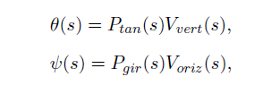

# Helicopter-model-movement

### Suportul fizic pe care se afla elicopterul (model in miniatura)

### Functiile de transfer corespunzatoare modelelor ce caracterizeaza rotatia pe cele doua axe

Theta si Csi reprezinta unghiurile de tangaj, respectiv giratie
Vvert si Voriz sunt tensiunile electrice furnizate motoarelor din plan vertical, resepectiv orizontal

Ptan este functia ce caractertizeaza rotatia in plan verical

Pgir este functia ce caracterizeaza rotatia in plan orizontal

### Functia de transfer in plan vertical

### Functia de transfer in plan orizontal

